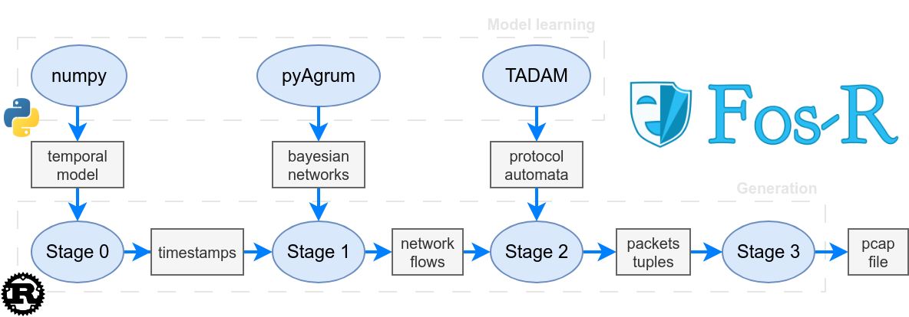

# How it works

Fos-R generates data with a four-staged generation, as indicated in the schema below.

If you want to know more about the science behind Fos-R, check the [publications](./index.html#publications).
